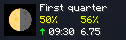

# Moon Phase Indicator (Minecraft Mod)

Displays information about the moon phase.

## Features

* Displays the following information:
  * Moon icon (moon texture)
  * Moon phase (name)
  * Moon size (percentage)
  * Relative size of next moon phase (arrow)
  * Real time until next moon phase (mm:ss)
  * Phantom spawn chance (percentage)
  * Game days since last rest (number)
* Keybindings (Default: `I` to toggle indicator and `U` to show configuration screen)
* Configuration options (availiable via keybinding or [Mod Menu](https://modrinth.com/mod/modmenu/) for Fabric, if installed):
  * General
    * Show indicator (`Yes` or `No`)
    * Show indicator in (`All dimensions`, `Overworld only` or `Nether and End only`)
    * Indicator position  (`Bottom Right`, `Top Left`, etc.)
    * Compact mode (`Yes` or `No`)
    * Horizontal offset (`0%` - `50%`)
    * Vertical offset (`0%` - `50%`)
    * Background opacity (`0` - `255`)
    * Background color (`#000000` - `#ffffff`)
  * Icon
    * Icon style (`Resource Pack`, `Default / Vanilla` or `Emoji`)
    * Icon size (`Small`, `Medium`, etc.)
    * Show sun icon (`Yes` or `No`)
    * Zoomed icon (`Yes` or `No`)
  * Phantom
    * Show phantom statistics (`Yes` or `No`)
    * Statistics polling interval (`1` - `5`)

## Download

*Coming soon*

## License

This project is available under the [MIT license](./LICENSE).